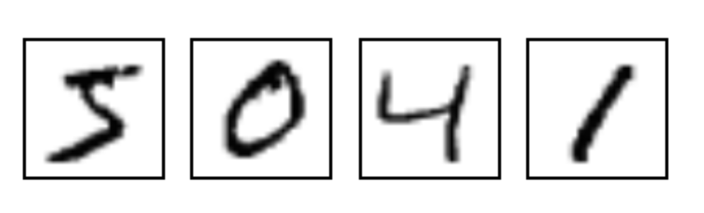

## 简述

---

Keras是一个高层神经网络API，Keras由纯Python编写而成并基Tensorflow、Theano以及CNTK后端。Keras 为支持快速实验而生，能够把你的idea迅速转换为结果。

## 参考

---

基于[简单的Keras实例](https://www.heywhale.com/mw/project/5e1c14582823a10036b474de/content)和[Keras中文教程](https://keras.io/zh/)

## 关于数据集

---

1. 背景介绍：

   该数据集为一个手写数字的图片数据库，每一张图片为0-9中的单个数字。可以用来设计算法和模型进行手写数字的识别，图片如下所示：

   

2. 数据描述：

   数据集共包含四个IDX格式文件，IDX格式是一种用来存储向量与多维度矩阵的文件格式:

   + train-images-idx3-ubyte.gz: 训练集图片——55000张训练图片, 5000张验证图
   + train-labels-idx1-ubyte.gz: 训练集图片对应的数字标签
   + t10k-images-idx3-ubyte.gz: 测试集图片—–10000张图片
   + t10k-labels-idx1-ubyte.gz: 测试集图片对应的数字标签

   每个集合包含图片和标签两部分内容，图片为28*28点阵图；标签为0-9之间数字。
